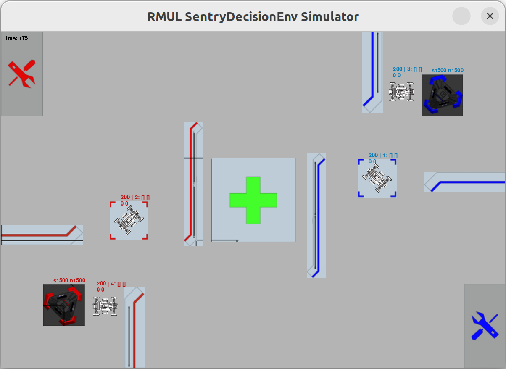

# RMUL SentryDecisionEnv Simulation 2D

RMUL SentryDecisionEnv Simulation 2D，简称`RMSDS`，是为参加 [RMUL2024](https://www.robomaster.com/zh-CN/robo/college-league?djifrom=nav) 设计的模拟器，主要作用是为智能决策组训练神经网络提供仿真环境，主要灵感来源于RMUA2019赛事的一款训练模拟器[RoboMaster-AI-Challenge-Simulator-2D](https://github.com/LoveThinkinghard/RoboMaster-AI-Challenge-Simulator-2D)，可以视为该模拟器的联盟赛适配版本

游戏帧率在200fps左右

## 一、依赖

numpy

[pygame](https://www.pygame.org/)（作用仅为可视化）

## 二、使用指南

### 1、基本信息

该模拟器由两个层次组成：

>上层的封装类`rmaics`  
>底层的实际执行类`kernal`

使用者需要定义`rmaisc`类中的`get_observation`和`get_reward`函数，来定义观测值和奖励值；而`kernal`类只负责物理环境和裁判系统的仿真。故训练网络时，直接与使用者打交道的为`rmaisc`类

### 2、内容引索

请根据以下引索，寻找需要的内容

`rmaics`使用说明：[rmaics_manual.md](./docs/rmaics_manual.md)

`kernal`使用说明：[kernal_manual.md](./docs/kernal_manual.md)

`record player`使用说明：[record_player.md](./docs/record_player.md)

控制指令说明：[operation.md](./docs/operation.md)

参数格式说明：[params.md](./docs/params.md)

`kernal`开发指南：[develop.md](./docs/develop.md)

### 3、TODO

· 完善基地机器人的机制

· 完善中心增益区的机制

· 修改后的参数readme适配

# 2D-sentry-decisionTrainingEnv-simulator
